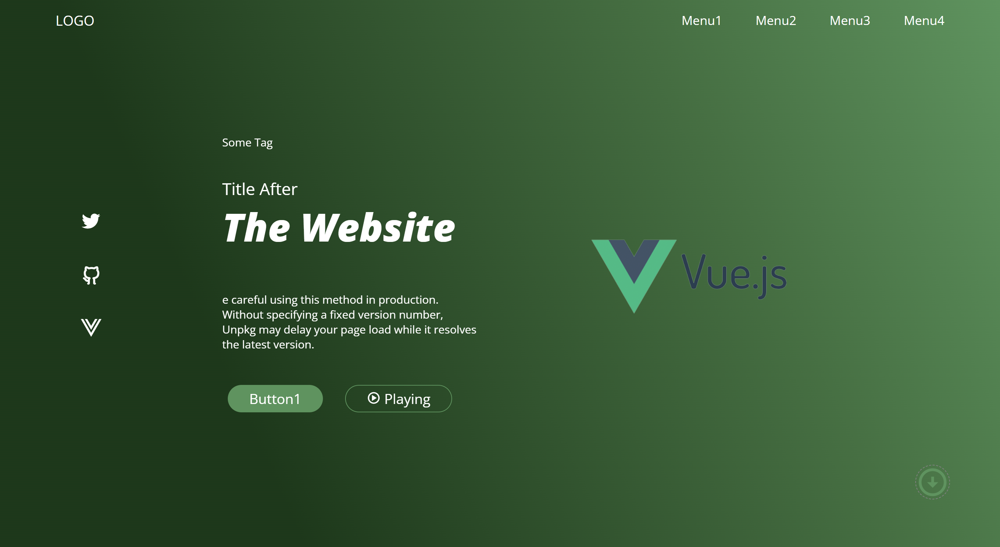
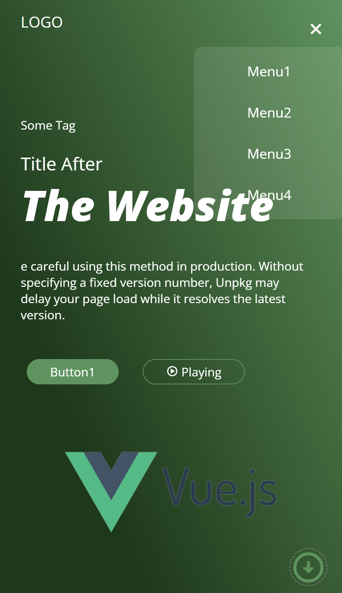

## CSS_PRACTICE  HTML、CSS 练习案例

> 自己学习 HTML、CSS、以及 JS 写的一些小案例
>
> 

## 有什么问题或者需要技术支持的，扫下方二维码加我个人微信：a460467324

 -  [Chapter12_HOME_PAGE](https://github.com/Largefreedom/HTML_PRACTICE/tree/master/%E6%B7%B1%E5%85%A5%E8%A7%A3%E6%9E%90CSS/Chapter12_HOME_PAGE)  简单网页布局样式

* [Pra2_progress_steps](https://github.com/Largefreedom/HTML_PRACTICE/tree/master/Pra2_progress_steps) 动画进度条

* [Pra4_Auto_text_effect](https://github.com/Largefreedom/HTML_PRACTICE/tree/master/Pra4_Auto_text_effect) 文本自动补充动画

* [Web2_Responsive](https://github.com/Largefreedom/HTML_PRACTICE/tree/master/Web2_Responsive)  -> **响应式网页布局自适应PC和移动端**

PC端

移动端

